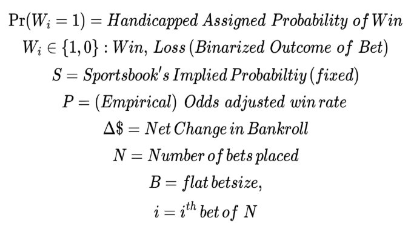
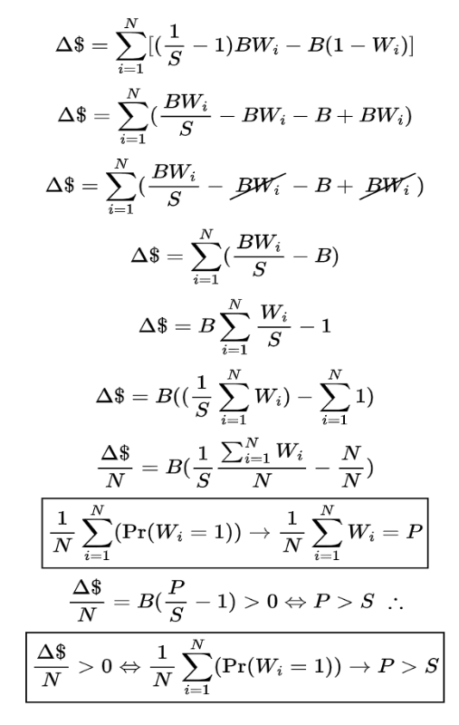
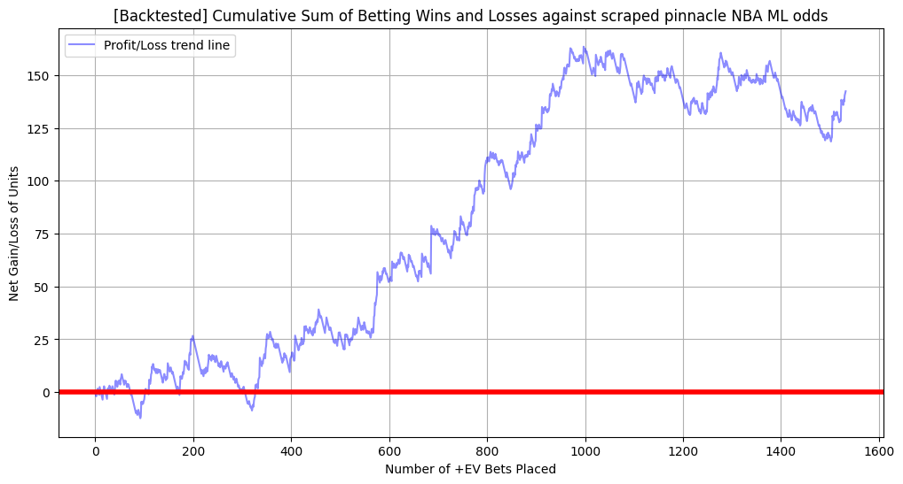

# Plus-EV-betting-Math

## In this Repository I present the underlying math that constitutes TRUE positive expected value betting. The concept of plus EV betting is commonly talked about amongst sports bettors and is a popular strategy for generating income from sports betting. Unfortunately many bettors fail to ever grasp the true underlying math that makes sports betting profitable. Due to this lack of understanding many bettors "sour" on +EV betting after a short time because they fail to understand the underlying objective. Here I give a short yet thorough analysis of +EV betting in the context of moneyline (selecting winners outright) betting assuming a flat betting strategy. 

The Handicapped (Assigned) Probability of a Win (line 1) is the probability, we the bettors, find through some method we trust (handicapping). Some bettors rely on observational analysis in which they simply watch a lot of sports and develop a “gut feel” or “intuition” for when a team should win against their opponent. The problem with this method is that it does not allow you to actually QUANTIFY your degree of certainty. Line 2 is the binarized outcome of the bet which is simply the outcome of if we won or lost the bet. The term “binarized” just means we have two possible outcomes (i.e. we won or lost). This is how most sports bets are structured. Line 3 is the implied probability of the odds that the sportsbooks are offering us. Every set of odds has a corresponding implied probability formed by the market that represents the market’s “opinion” on what the outcome of the bet will be. P in Line 4 is the empirical win proportion at any fixed set of odds. All this means is that P represents the LONG TERM FREQUENCY we win at on a FIXED set of odds. For example if we place 700 moneyline bets and all of those bets are at -200 odds and we win 490 of those 700 bets, then our empirical win proportion = P = 490/700 = .70. Placing 700 bets may seem like an excessive amount but this is not necessarily always the number of bets needed to profit. Sometimes it's much less and sometimes it's much more. Line 5 is simply our change in bankroll. Obviously this is what we are mostly concerned about. If this is greater than zero then we are profiting from sports betting. If it is less than zero then we are losing bettors. N is the number of bets placed in any given unit of time. Earlier I gave an example of 700 bets so in that situation N = 700. For some bettors this may only be 10 and for others it may be 10,000. The main idea is that it represents a specific set of bets placed on a fixed set of sportsbooks odds. B in Line 7 is the variable for our flat bet size. Flat betting simply means we are betting the same exact amount every single time we bet. In actuality this is NOT an optimal betting strategy but it makes the math a bit easier here. Again, this varies from one bettor to another - some sports bettors have a flat bet size of $1.00 while others may have a flat bet size of $1,000. All that matters is that it's a value you are comfortable betting and can sustain long-term. Finally i in line 8 is just the index used to denote which bet out of N we are on. 

## The Math of Profiting

##As mentioned earlier if our delta bankroll (  ) is greater than zero we are profiting. Above I have 10 lines of math that show us how we profit. Rather than going through each line I would like to talk about a few key conclusions the math shows us. Line #1 comes from calculating and summing the percentage of bet returned on a win vs a loss. In sports betting if you win the bet your following change in bankroll comes from the percentage of the bet returned on a win (ie the first term in line #1) while if you lose a bet your change in bankroll comes you losing the entire amount that you bet (the second term in line #1). For any finite number of bets we can calculate our net change in bankroll by summing these gains and losses. That is how we derive line #1. From here, everything else follows from algebra. Jumping down to line #7, here we divide the net change in bankroll by N (the number of bets placed). And we show that this fraction can be made greater than zero. This is crucial to being a profitable bettor because it highlights the following: If and ONLY IF a bettor truly has an edge relative the odds they are offered by their sportsbook, can a bettor expect their bankroll to grow the more they bet. This is because on average each bet contributes to their net gain over a large enough number of bets (ie N becoming large). 

### Calibration
Line #8 shows the importance of CALIBRATION. The first term in the box is the probability given to us by our handicapping strategy. This line is required to profit and only holds true under the condition that we as sports bettors are indeed calibrated. Calibration does NOT mean being correct - instead it means if you believe there is a 30%,50%,70%...etc probability of an outcome - then the outcome indeed happens 30%,50%,70%...etc of the time. When your degree of certainty matches the empirical frequency of an event then you are calibrated. This means that our handicapping process should almost never “pick” winners but rather should quantify and measure our degree of certainty and confidence in one outcome or another. This proves that it is erroneous to say for example: “Team A will absolutely beat Team B, so taking Team A is a sharp bet”. Instead, someone who truly understands sharp betting would say, “Team A has a higher probability of beating Team B relative to the probability implied by the sportsbooks, thus Team A has VALUE”. This all implies that sometimes we should pick the heavy favorite and sometimes we should pick the underdog depending on what our handicap has told us. If you hear someone say, “you should never take a -800 favorite” or “you should never back a +900 underdog” then they are mistaken in what sports betting is truly about. Finally line 10 follows from all lines above and demonstrates that if we are indeed calibrated and avoid ruin by overbetting (i.e. bankroll management) then our average change in bankroll per bet will be greater than zero - implying that we are making money. We see that the most important task of a sharp handicapper is calculating the probability of each outcome of a bet (line 8). This is the fundamental idea of sharp betting and understanding this concept separates profitable sharp bettors from casual/”square” bettors. 

# Variance, Drawdowns and Upswings

Above I have an image from a backtested model that shows the actual change in bankroll from applying a betting model I made in python (See nba model github). Notice that there are both drawdowns AND upswings in the net change in bankroll. Why is this, if we are doing +EV betting?? The answer is variance. Variance is the irreducible amount of randomness that is embedded in any finite set of bets. This means that sometimes we will have stretches of bets where the bankroll decreases (drawdowns) and other stretches where it increases (upswings). Luckily If we are truly betting with an edge then the quantity and magnitude of upswings will overcome the quantity and magnitude of drawdowns allowing us to make profits long-term. This is why sports betting is often referred to as “The patient man’s game”. 

## GLOSSARY:
##Calibration:
Agreement between a bettor’s degree of confidence/certainty/probability and their empirical win proportion/ win frequency. 
##Value:
A bet where the handicapped probability is greater than the probability implied by your sportsbook’s odds. 
##Handicap:
The believed probability of a bet. Handicapping is the process of finding that probability.
###robability:
Number between 0 and 1 that corresponds to a bettor's degree of certainty in one outcome or another. 
##Empirical Win Proportion:
The proportion of bets won at a FIXED set of odds (e.g number of bets won out of ALL bets placed on -200 odds).
##Edge:
Handicapping process that allows a bettor to find value. 
##Variance:
The irreducible unavoidable randomness found in any finite number of bets that a bettor must overcome through having an edge and being calibrated. 
##Vigorish:
The tax/fee that sportsbooks embed in their provided odds that a bettor must overcome through having an edge. 
